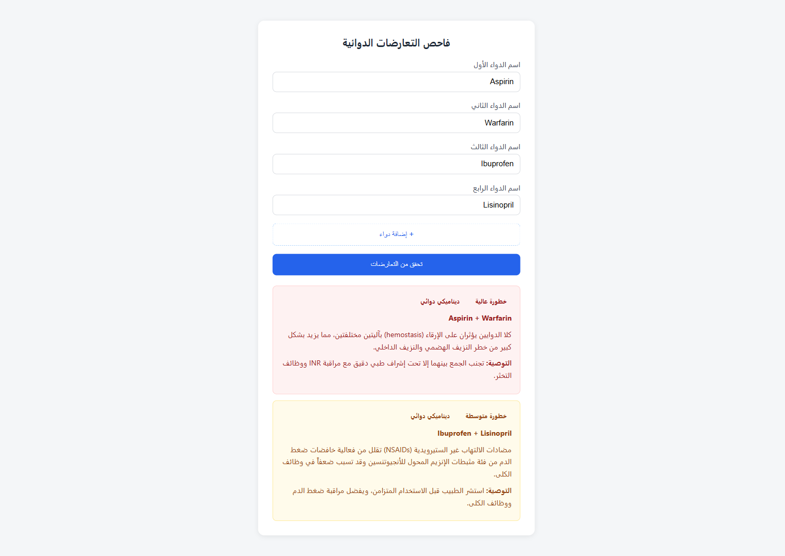
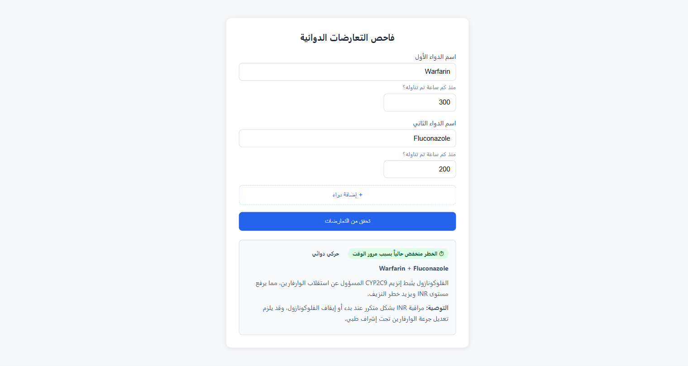

# Virexa — فاحص التفاعلات الدوائية

> **A FastAPI service that checks drug–drug interactions across a list of medications, with fuzzy name matching and time-aware severity for pharmacokinetic interactions.**

خدمة API مبنية بـ FastAPI مع واجهة ويب بسيطة، للكشف عن التفاعلات الدوائية بين دواءين أو أكثر. تفحص كل الأزواج الممكنة من قائمة الأدوية دفعة واحدة، وتأخذ بالاعتبار نوع التفاعل (ديناميكي أو حركي دوائي) والوقت الذي مضى منذ تناول كل دواء عند تقييم مستوى الخطورة.

> ⚠️ **تنبيه طبي:** هذا المشروع للأغراض **التعليمية والتجريبية فقط**. البيانات محدودة ولم تُراجع سريرياً، ولا يجوز استخدامه لاتخاذ قرارات علاجية. استشر طبيباً أو صيدلانياً دائماً قبل الجمع بين أي أدوية.
>
> **Medical disclaimer:** For educational purposes only. Not a substitute for professional medical advice.



## المميزات

- **فحص عدة أدوية معاً:** من 2 حتى 8 أدوية في الواجهة، ويُفحص كل زوج منها.
- **مطابقة تقريبية للأسماء** باستخدام [RapidFuzz](https://github.com/rapidfuzz/RapidFuzz): تتحمّل الأخطاء الإملائية البسيطة (مثلاً `aspirn` ← `Aspirin`).
- **خطورة تراعي الوقت:** في التفاعلات الحركية (pharmacokinetic) تنخفض الخطورة إذا مضى وقت كافٍ بالنسبة لنصف عمر الدواء.
- **واجهة عربية (RTL)** تعرض كل تفاعل في بطاقة ملوّنة حسب الخطورة.
- **توثيق تفاعلي** للـ API عبر Swagger على `/docs`.

## التقنيات

Python · FastAPI · Pydantic · RapidFuzz · Uvicorn · HTML/CSS/JS

## هيكل المشروع

```text
Virexa/
├── main.py                 # تطبيق FastAPI ومنطق الفحص
├── data/interactions.json  # بيانات الأدوية (نصف العمر) والتفاعلات
├── static/index.html       # واجهة المستخدم
├── screenshots/            # صور توضيحية
└── requirements.txt
```

## التشغيل محلياً

```bash
git clone https://github.com/IbrahimSWE/Virexa.git
cd Virexa
python -m venv venv
```

فعّل البيئة الافتراضية:

| النظام | الأمر |
|---|---|
| Windows (PowerShell) | `.\venv\Scripts\Activate.ps1` |
| Windows (cmd) | `venv\Scripts\activate.bat` |
| macOS / Linux | `source venv/bin/activate` |

ثبّت المكتبات وشغّل الخادم:

```bash
pip install -r requirements.txt
uvicorn main:app --reload
```

- الواجهة: `http://127.0.0.1:8000/`
- توثيق Swagger: `http://127.0.0.1:8000/docs`

## الـ API

### `POST /check-interaction`

**الطلب:**
```json
{
  "drugs": [
    { "name": "Aspirin", "hours_since_taken": 3 },
    { "name": "Warfarin", "hours_since_taken": 5 },
    { "name": "Ibuprofen" }
  ]
}
```

| الحقل | الوصف |
|---|---|
| `drugs` | قائمة الأدوية، ويجب أن تحتوي على دوائين على الأقل (وإلا يرجع الخادم `422`). |
| `name` | اسم الدواء. المطابقة لا تتأثر بحالة الأحرف ولا بالمسافات الزائدة ولا بترتيب الدواءين، وتقبل الأخطاء الإملائية البسيطة. |
| `hours_since_taken` | اختياري، وقيمته الافتراضية `0` (أي أن الدواء أُخذ الآن). |

**الاستجابة عند وجود تعارض:**
```json
{
  "interactions_found": [
    {
      "drug_a": "Aspirin",
      "drug_b": "Warfarin",
      "interaction_type": "pharmacodynamic",
      "severity": "high",
      "description": "...",
      "recommendation": "...",
      "matched_names": { "drug_a": "تم اعتبار (aspirn) كـ (Aspirin)" }
    }
  ]
}
```
لا يظهر `matched_names` إلا إذا جرى تصحيح اسم دواء بالمطابقة التقريبية. وفي التفاعلات الحركية يظهر أيضاً الحقل `time_adjusted`.

**الاستجابة عند عدم وجود تعارض معروف:**
```json
{ "message": "لا يوجد تعارض معروف بين الأدوية المدخلة" }
```

## مطابقة الأسماء

1. إذا تطابق الاسم بعد تحويله لأحرف صغيرة وحذف المسافات الزائدة، يُعتمد مباشرة.
2. إذا لم يتطابق، يُقارن مع كل الأسماء المعروفة باستخدام `fuzz.ratio`، ويُقبل أقرب اسم إذا كانت درجة التشابه **85% أو أكثر**.
3. إذا كانت الدرجة أقل من ذلك، يُعتبر الدواء غير معروف ويُستبعد من الفحص.

## منطق التفاعل الزمني

- **pharmacodynamic:** الوقت لا يقلل الخطر، لأن الدواءين يؤثران على نفس الجهاز في نفس الوقت، فيبقى التحذير كاملاً.
- **pharmacokinetic:** الوقت قد يقلل الخطر، لأن أحد الدواءين يؤثر على استقلاب الآخر أو تصفيته، وهذا التأثير يضعف كلما تخلّص الجسم من الدواء.

**المعيار:** تُحسب لكل دواء في الزوج النسبة `hours_since_taken / half_life_hours`. إذا كانت **أصغر** النسبتين **5 أو أكثر** (أي مضى ما يعادل 5 أضعاف نصف العمر على الأقل)، تصبح `time_adjusted: true` وتُستبدل `severity` بالعبارة "منخفض الخطورة حالياً بسبب مرور وقت كافٍ". غير ذلك تبقى الخطورة الأصلية مع `time_adjusted: false`.



## الحدود الحالية

- البيانات محدودة بـ **32 دواءً** و**20 تفاعلاً** في `data/interactions.json`، وليست شاملة.
- المطابقة التقريبية تشمل الأسماء العلمية الموجودة فقط، ولا تتعرف على الأسماء التجارية.
- الفحص يتم لكل زوج على حدة (Pairwise)، ولا يدعم التفاعلات الثلاثية.
- لا توجد قاعدة بيانات أو سجل للمريض، فكل طلب مستقل.

## أفكار للتطوير

- دعم الأسماء التجارية وربطها بالاسم العلمي.
- فحص التفاعلات الثلاثية.
- ربط المشروع بمصدر بيانات دوائية موثوق بدل الملف الثابت.
- كتابة اختبارات آلية (pytest).

## الرخصة

[MIT](LICENSE)
